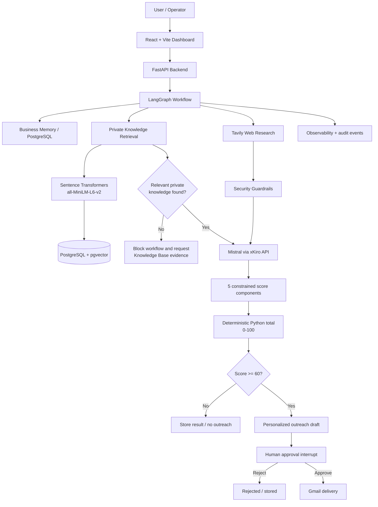

# Autonomous AI Employee

An end-to-end autonomous business-development agent that researches prospect companies, retrieves relevant private company knowledge, scores opportunities, drafts personalized outreach, and requires human approval before email delivery.

The project combines **agent orchestration, retrieval-augmented generation (RAG), web research, deterministic lead scoring, security guardrails, human-in-the-loop approval, observability, Docker, and CI/CD** in one working application.

---

## Why this project exists

A business-development workflow usually requires several disconnected steps:

1. Research a company.
2. Understand whether the prospect has a real business need.
3. Compare that need with the seller's actual capabilities.
4. Decide whether the opportunity is worth pursuing.
5. Draft personalized outreach.
6. Review the message before sending it.
7. Preserve the workflow state and audit trail.

This project automates that process while keeping an explicit **human approval gate** before outbound email.

A core design rule is:

> The agent does not simply match a prospect's services to our services. It asks what our AI company can actually do to address an evidence-supported need at the prospect.

---

## Key capabilities

- **Autonomous prospect research** using Tavily web search
- **Private RAG knowledge base** for internal services, capabilities, case studies, pricing, and sales playbooks
- **Mistral-based reasoning** over public prospect evidence + private company knowledge
- **Hard RAG evidence gate**: no private knowledge means no seller-prospect fit score, no outreach draft, and no send path
- **Five-component lead scoring** with a deterministic Python total
- **Human-in-the-loop approval** before Gmail delivery
- **Knowledge Base CRUD** with upload, edit, re-index, and delete flows
- **LangGraph checkpointing** for resumable workflow state
- **Prompt-injection defenses** for untrusted web content
- **Authentication and role-aware protected routes**
- **Operational observability** for workflow stages and failures
- **Dockerized full stack** with PostgreSQL + pgvector
- **GitHub Actions CI** for backend tests, frontend builds, and frontend Docker builds
- **GHCR publishing workflow** for tagged container images

---

## Architecture



---

## Agent workflow

The main workflow is:

```text
Check business memory
        ↓
Research prospect on the public web
        ↓
Retrieve relevant private company knowledge
        ↓
Require relevant private RAG evidence
        ↓
Mistral analyzes public + private evidence
        ↓
Generate 5 constrained score components
        ↓
Python validates and sums score to 0-100
        ↓
If score >= 60, draft outreach
        ↓
Human approval
        ↓
Send or reject
```

The hard RAG gate is important. If semantic retrieval returns no relevant internal evidence, the workflow stops before Mistral performs seller-prospect fit analysis. This prevents the system from inventing what the seller can offer.

---

## Lead scoring

Each prospect receives five component scores from **0 to 20**:

| Component | Meaning |
|---|---|
| Industry fit | How relevant the prospect's industry is to the seller's capabilities |
| Company size fit | Whether the organization appears suitable for the offering |
| AI need | Strength of evidence that the prospect has an AI/data/automation need |
| Growth signal | Evidence of investment, expansion, transformation, hiring, or strategic growth |
| Contact potential | Practical likelihood of identifying an appropriate outreach path |

The LLM provides constrained component assessments. Python validates the values and calculates the total:

```text
Lead Score =
industry_fit
+ company_size_fit
+ ai_need
+ growth_signal
+ contact_potential
```

Maximum score: **100**

Current outreach threshold: **60**

This means the reasoning component is model-assisted, while the final arithmetic is deterministic.

---

## RAG design

The Knowledge Base represents the **seller's private company knowledge**, not the prospect.

Supported document types include:

- TXT
- Markdown
- PDF

Documents are chunked and embedded using:

```text
sentence-transformers/all-MiniLM-L6-v2
Embedding dimension: 384
```

Embeddings are stored in PostgreSQL with **pgvector** and retrieved through semantic similarity search.

Typical private documents include:

- service descriptions
- AI capabilities
- case studies
- pricing guidance
- sales playbooks
- delivery constraints
- positioning notes

The dashboard supports document upload, inspection, editing and re-indexing for editable text formats, and deletion.

---

## AI components

### Mistral

Mistral is the primary reasoning model. It:

- analyzes prospect evidence
- combines public research with private RAG context
- proposes constrained scoring components
- identifies relevant seller capabilities
- drafts personalized outreach

### LangGraph

LangGraph orchestrates the agent. It manages:

- workflow state
- node execution
- conditional routing
- persistence/checkpointing
- human approval interrupts
- workflow resumption

### Hugging Face embeddings

The sentence-transformer model is used only for vector embeddings and semantic retrieval. It is **not** the main reasoning model.

A concise architecture explanation is:

> LangGraph orchestrates the agent, Hugging Face generates embeddings for RAG retrieval, pgvector finds relevant internal knowledge, and Mistral reasons over the retrieved private knowledge together with public Tavily research.

---

## Security and safety design

The application includes multiple defensive layers around external and model-generated content.

Implemented controls include:

- prompt-injection detection for untrusted web evidence
- neutralization / warning behavior based on detected risk
- protected authentication routes
- role-aware Knowledge Base mutations
- server-side workflow validation
- human approval before outbound email
- send-path safeguards and idempotency
- explicit separation between public web evidence and private internal knowledge
- no seller-prospect fit scoring when private evidence is missing

The system treats web research as **untrusted data**, not as instructions to the agent.

---

## Technology stack

### Backend

- Python 3.11
- FastAPI
- LangGraph
- SQLAlchemy
- PostgreSQL 18
- pgvector
- sentence-transformers
- Mistral through an OpenAI-compatible xKiro endpoint
- Tavily
- Gmail API

### Frontend

- React 19
- TypeScript
- Vite
- Axios
- Recharts
- Lucide React

### Infrastructure

- Docker
- Docker Compose
- Nginx frontend container
- GitHub Actions
- GitHub Container Registry workflow
- Cloudflare Quick Tunnel for temporary public demonstrations

---

## Local setup with Docker

### 1. Clone the repository

```bash
git clone https://github.com/mishal913/autonomous-ai-employee.git
cd autonomous-ai-employee
```

### 2. Configure Docker database credentials

Copy:

```text
.env.docker.example
```

to:

```text
.env.docker
```

and set a local PostgreSQL password.

### 3. Configure application environment

Create a local `.env` file containing the application configuration required by the backend, including values for services such as the LLM endpoint, Tavily, authentication, and optional Gmail integration.

Do not commit local secret files.

### 4. Build and start

```bash
docker compose --env-file .env.docker up -d --build
```

### 5. Check containers

```bash
docker compose --env-file .env.docker ps -a
```

Expected services include:

- `database`
- `init-backend`
- `backend`
- `frontend`

The one-shot `init-backend` service is expected to exit successfully after initializing SQLAlchemy and LangGraph checkpoint tables.

### 6. Open the application

```text
http://localhost:8080
```

The backend is also exposed locally on:

```text
http://localhost:8000
```

---

## Development workflow

After changing backend or frontend code:

```bash
docker compose --env-file .env.docker up -d --build
```

Then test locally.

When the change is ready:

```bash
git status
git add .
git commit -m "Describe the change"
git push
```

GitHub Actions automatically validates the pushed code.

---

## CI/CD

The repository includes GitHub Actions workflows for continuous integration.

Current CI checks include:

- backend test suite against PostgreSQL + pgvector
- frontend TypeScript/Vite production build
- frontend Docker image build

A separate image-publishing workflow can publish backend and frontend container images to **GitHub Container Registry (GHCR)** for version tags.

---

## Project structure

```text
autonomous-ai-employee/
├── app/
│   ├── main.py
│   ├── workflow.py
│   ├── rag.py
│   ├── ai.py
│   ├── tools.py
│   ├── security_guardrails.py
│   ├── secure_tools.py
│   ├── observability.py
│   ├── auth.py
│   ├── knowledge_api.py
│   ├── knowledge_admin.py
│   ├── gmail_client.py
│   └── ...
├── frontend/
│   ├── src/
│   └── Dockerfile
├── evaluation/
│   └── rag_test_cases.json
├── tests/
├── docker/
│   └── postgres/
├── .github/
│   └── workflows/
├── Dockerfile
├── docker-compose.yml
├── docker-compose.prod.yml
└── requirements.lock.txt
```

---

## Design decisions

### Why require private RAG evidence?

Public research can show that a prospect has an AI need, but it cannot prove that the seller has a capability that addresses that need.

The workflow therefore requires relevant internal evidence before producing a seller-prospect fit score.

### Why use deterministic scoring after the LLM?

The model is useful for evidence interpretation, but the final total should be transparent and reproducible. Each component is constrained to 0-20 and Python performs the final calculation.

### Why keep human approval?

Outbound communication is a consequential external action. The agent can research, reason, score, and draft autonomously, but the final email action remains under human control.

### Why LangGraph?

The workflow requires state, branching, persistence, interruption, and resumption. Those requirements are more naturally modeled as a graph than as a single prompt chain.

---

## Example use case

A user enters a prospect such as a large industrial company.

The agent:

1. searches the public web for current business and AI-related evidence,
2. retrieves internal documents describing the seller's relevant AI services,
3. verifies that private evidence exists,
4. asks Mistral to connect the prospect's need to supported seller capabilities,
5. calculates the opportunity score,
6. drafts a personalized email when the threshold is met,
7. pauses for human review,
8. sends only after approval.

---

## Current status

The application has been tested end-to-end locally in Docker, including:

- authentication
- public company research
- private RAG retrieval
- missing-knowledge blocking
- lead scoring
- outreach generation
- Knowledge Base editing/deletion
- human approval flow
- frontend/backend integration
- PostgreSQL persistence
- CI validation

---

## Portfolio focus

This project demonstrates practical experience with:

- agentic AI architecture
- LLM application engineering
- RAG
- vector databases
- prompt-injection defense
- workflow orchestration
- human-in-the-loop systems
- full-stack development
- API integration
- Docker
- CI/CD
- applied AI product design

---

## Planned portfolio additions

- polished application screenshots
- short architecture walkthrough
- end-to-end demo video
- example anonymized prospect run
- expanded evaluation results

---

## Project note

Built as a portfolio project exploring how autonomous AI agents can combine private enterprise knowledge, public research, deterministic business logic, and human oversight in a real workflow.
