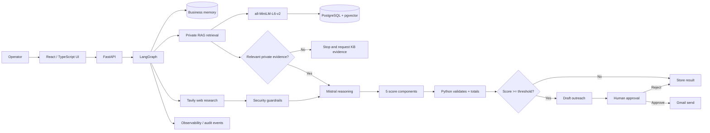

# Autonomous AI Employee

> Evidence-grounded autonomous business-development agent with private RAG, deterministic lead scoring, security guardrails, and human approval before outbound email.

[](https://github.com/mishal913/autonomous-ai-employee/actions/workflows/ci.yml)


## quick scan

| Area | Implementation |
|---|---|
| Agent orchestration | LangGraph state machine with persistence, conditional routing, and human-in-the-loop interruption |
| Reasoning | Mistral through an OpenAI-compatible xKiro endpoint |
| Public research | Tavily web research |
| Private knowledge | RAG over TXT/MD/PDF using sentence-transformers + PostgreSQL/pgvector |
| Qualification | Five constrained 0-20 criteria; Python validates and deterministically totals 0-100 |
| Safety | Prompt-injection scanning, untrusted-evidence isolation, RAG evidence gate, approval gate, send validation |
| Product layer | React + TypeScript dashboard, Knowledge Base CRUD, live execution trace, observability |
| Infrastructure | Docker Compose, PostgreSQL 18 + pgvector, Nginx frontend, GitHub Actions, GHCR publishing workflow |

## What the system does

The agent researches a prospect, retrieves relevant private company knowledge, connects the prospect's evidence-supported needs to capabilities the seller can actually provide, scores the opportunity, drafts personalized outreach, and pauses before the Gmail side effect for explicit human approval.

A key rule is enforced in code:

> **No relevant private company knowledge -> no seller-prospect fit score, no outreach draft, and no send path.**

This prevents the system from treating public prospect information alone as proof that the seller can solve the prospect's problem.

## Architecture



For a deeper technical walkthrough, see [docs/ARCHITECTURE.md](docs/ARCHITECTURE.md).

## Workflow

```text
Business memory
      |
Live web research
      |
Private knowledge retrieval
      |
Relevant RAG evidence gate
      |
Mistral analysis
      |
Five constrained score components
      |
Deterministic Python total
      |
Route by threshold
      |
Outreach draft
      |
Human approval
      |
Send or reject
```

## Lead scoring

Each criterion is constrained to **0-20**:

- industry fit
- company-size fit
- AI need
- growth signal
- contact potential

The LLM assesses the evidence for each component. Python validates the allowed range and calculates the final score out of 100. The current outreach threshold is 60.

## RAG and Knowledge Base

The Knowledge Base represents the **seller's own services and capabilities**.

Supported content includes TXT, Markdown, and PDF. Documents are chunked, embedded with `sentence-transformers/all-MiniLM-L6-v2` (384 dimensions), stored in PostgreSQL with pgvector, and retrieved by semantic similarity.

The UI supports:

- upload and indexing
- document listing
- TXT/MD editing
- automatic re-embedding after edits
- deletion
- inspection of retrieved chunks during agent execution

## Security model

Public web pages and retrieved text are treated as **data, not instructions**. The application includes prompt-injection detection, evidence isolation, deterministic action checks, authenticated routes, role-aware Knowledge Base mutations, and human approval before email delivery.

See [SECURITY.md](SECURITY.md) for the threat model and controls.

## Tech stack

**AI / orchestration:** LangGraph, Mistral, Tavily, sentence-transformers  
**Backend:** Python 3.11, FastAPI, SQLAlchemy  
**Data:** PostgreSQL 18, pgvector  
**Frontend:** React 19, TypeScript, Vite, Axios, Recharts  
**Actions:** Gmail API with approval-gated send path  
**Infrastructure:** Docker, Docker Compose, Nginx, GitHub Actions, GHCR

## Quick start

### 1. Clone

```bash
git clone https://github.com/mishal913/autonomous-ai-employee.git
cd autonomous-ai-employee
```

### 2. Create local environment files

Copy the templates:

```text
.env.example        -> .env
.env.docker.example -> .env.docker
```

Replace every `CHANGE_ME` value locally. Never commit real credentials.

### 3. Start the stack

```bash
docker compose --env-file .env.docker up -d --build
```

### 4. Inspect services

```bash
docker compose --env-file .env.docker ps -a
```

Expected services:

- `database`
- `init-backend` (one-shot initializer; successful exit is expected)
- `backend`
- `frontend`

Open the UI at:

```text
http://localhost:8080
```

Backend health/API:

```text
http://localhost:8000
```

## Development

After code or Dockerfile changes:

```bash
docker compose --env-file .env.docker up -d --build
```

Backend tests:

```bash
python -m pytest -q
```

Frontend production build:

```bash
cd frontend
npm ci
npm run build
```

See [CONTRIBUTING.md](CONTRIBUTING.md) for the development and pull-request workflow.

## CI/CD

GitHub Actions validates the repository on pushes and pull requests:

- backend tests against PostgreSQL + pgvector
- frontend TypeScript/Vite build
- backend Docker image build
- frontend Docker image build

A separate workflow publishes tagged backend and frontend images to GitHub Container Registry.

## Repository structure

```text
.
├── app/                    # FastAPI, LangGraph, RAG, security, auth, Gmail
├── frontend/               # React + TypeScript dashboard
├── evaluation/             # RAG evaluation cases
├── tests/                  # Backend tests
├── docker/                 # Database initialization
├── docs/                   # Architecture documentation
├── .github/workflows/      # CI and image publishing
├── Dockerfile
├── docker-compose.yml
├── docker-compose.prod.yml
└── requirements.lock.txt
```

## Engineering decisions

**Why LangGraph?** The workflow needs persistence, branching, interruption, resumption, and explicit state transitions.

**Why deterministic scoring?** The model interprets evidence, but Python owns range validation and final arithmetic.

**Why a hard RAG gate?** Prospect evidence can establish need; it cannot establish the seller's capability. Private evidence is required before fit scoring.

**Why human approval?** Research and drafting can be automated, while consequential outbound communication remains under human control.

## Current status

The application has been exercised end-to-end with authentication, live research, private retrieval, missing-knowledge blocking, scoring, outreach drafting, Knowledge Base CRUD, human approval, PostgreSQL persistence, Dockerized services, observability, and CI.

Portfolio screenshots will be added under `docs/screenshots/`.

## Future extensions

- CRM integration
- MCP-based tool adapters
- richer lead/contact enrichment
- expanded RAG evaluation
- durable production deployment with a stable domain
- model and retrieval telemetry dashboards
