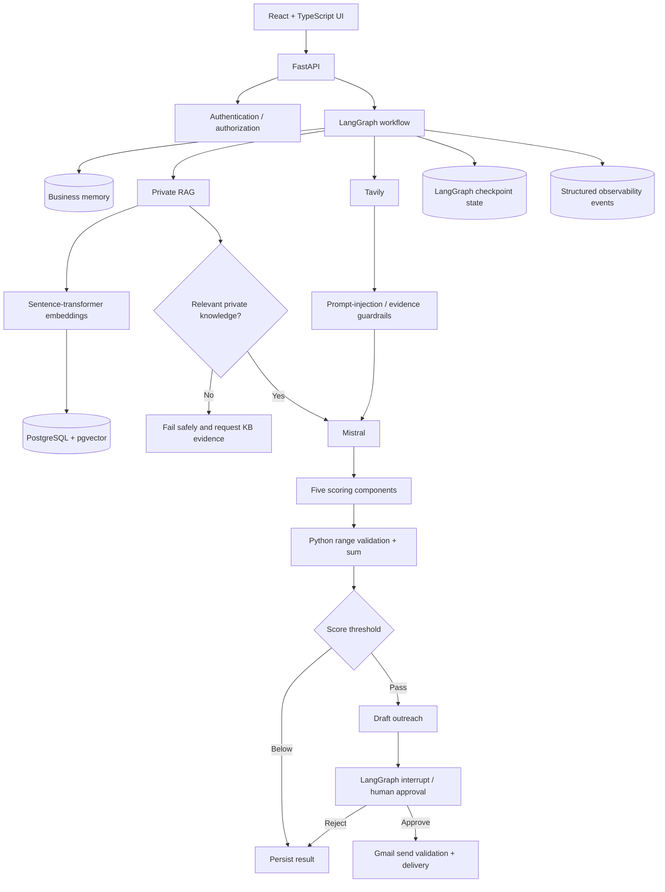

# Architecture

This document explains the technical architecture of the Autonomous AI Employee and the reasoning behind its main design choices.

## System context

The system automates a business-development workflow while preserving two explicit trust boundaries:

1. **Public prospect evidence is untrusted external data.**
2. **Outbound email is a consequential side effect and requires human approval.**

The agent therefore separates research, private retrieval, reasoning, deterministic business rules, and external actions.

## High-level architecture



## Major components

### Frontend

The React/TypeScript dashboard provides:

- command-center health and activity
- task launch form
- live workflow trace
- lead-score breakdown
- Knowledge Base upload/edit/delete UI
- human approval controls
- observability and security metrics

The frontend polls live task state from the FastAPI backend rather than displaying a hard-coded pipeline.

### FastAPI backend

FastAPI exposes application, workflow, authentication, Knowledge Base, observability, and approval endpoints.

The backend is responsible for validating state transitions and never relies on the browser alone for action safety.

### LangGraph

LangGraph is the orchestration layer. It is used because the workflow is stateful and non-linear.

Responsibilities include:

- node sequencing
- conditional routing
- checkpoint persistence
- human-in-the-loop interruption
- workflow resumption
- failure propagation

### Public research

Tavily collects prospect evidence from the public web. This content is treated as untrusted reference data.

Security guardrails inspect and frame external text before it reaches the reasoning model.

### Private RAG

Internal seller knowledge is indexed into PostgreSQL/pgvector.

The retrieval pipeline:

1. parses supported files
2. chunks document text
3. creates 384-dimensional embeddings with `all-MiniLM-L6-v2`
4. stores chunks and vectors
5. embeds the workflow query
6. retrieves semantically similar chunks
7. passes only relevant private evidence into downstream analysis

The Knowledge Base is about **what the seller can actually provide**.

### RAG evidence gate

A prospect may look attractive from public research alone, but that does not prove seller-prospect fit.

The workflow therefore blocks analysis when no relevant private chunks are retrieved.

This is both a product-quality and hallucination-control decision.

### Mistral reasoning

Mistral combines:

- guarded public prospect evidence
- relevant private seller knowledge
- the task objective

It identifies opportunity context, capability matches, and five constrained lead-score components.

### Deterministic scoring

The five component values are constrained to 0-20:

- industry fit
- company-size fit
- AI need
- growth signal
- contact potential

Python validates the values and calculates the final score. The total is not delegated to free-form model arithmetic.

### Human approval

Qualified opportunities can produce an outreach draft, but LangGraph pauses before the Gmail side effect.

The operator can reject or approve. Email delivery proceeds only after approval and server-side action validation.

## Persistence

PostgreSQL stores application state and domain data. pgvector supports semantic retrieval. LangGraph checkpointing supports durable workflow state and resumability.

Docker volumes preserve database and model-cache data across container restarts.

## Trust boundaries

```text
PUBLIC WEB
   |
   | untrusted evidence
   v
security guardrails
   |
   v
reasoning context

PRIVATE KNOWLEDGE BASE
   |
   | seller capability evidence
   v
semantic retrieval
   |
   v
RAG evidence gate

MODEL OUTPUT
   |
   | constrained score components / draft
   v
deterministic Python validation
   |
   v
HUMAN APPROVAL
   |
   v
external email side effect
```

## Failure behavior

The system intentionally fails closed in important cases:

- RAG retrieval infrastructure failure -> workflow failure
- zero relevant private chunks -> workflow blocked
- invalid scoring component -> server-side validation failure
- rejected approval -> no email action
- action validation failure -> no email action

## Deployment model

Local/full-stack development uses Docker Compose:

- PostgreSQL + pgvector
- one-shot backend initializer
- FastAPI backend
- Nginx-served frontend

Tagged builds can be published through GitHub Actions to GHCR.

A Cloudflare Quick Tunnel has been used for temporary public demos; it is not treated as a permanent production endpoint.

## Future architecture options

Potential extensions include:

- CRM connectors
- MCP tool adapters for external business systems
- queue-based background workers
- persistent production object storage
- model/retrieval telemetry
- richer contact enrichment
- multi-tenant authorization
